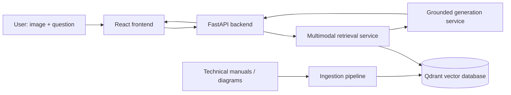

# Multimodal Repair Assistant

A portfolio-grade multimodal Retrieval-Augmented Generation (RAG) system for grounded technical troubleshooting from **text, images, diagrams, and manuals**.

The first demonstrated domain is bicycle repair, but the ingestion and retrieval architecture is intentionally domain-agnostic so the system can later support other technical-document collections.

## Product vision

A user should be able to upload an image of a damaged or malfunctioning component, ask a natural-language question, and receive a response grounded in a private knowledge base with page-level citations and supporting visual evidence.

The system is being designed to:

- retrieve relevant text passages, diagrams, and page images;
- combine text and visual evidence before generation;
- preserve document and page metadata for citations;
- return an **insufficient evidence** response instead of inventing unsupported guidance;
- evaluate retrieval quality separately from answer generation.

## Target architecture



## Planned stack

| Area | Technology |
| --- | --- |
| Backend | Python, FastAPI, Pydantic |
| PDF / image ingestion | PyMuPDF, Pillow |
| Embeddings | Sentence Transformers, CLIP-compatible multimodal models |
| Vector search | Qdrant |
| Frontend | React |
| Testing | pytest |
| Infrastructure | Docker, GitHub Actions |
| Deployment | Cloud Run or equivalent |

## Repository structure

```text
multimodal-repair-assistant/
├── data/
│   ├── documents/
│   ├── extracted/
│   └── evaluation/
├── src/
│   ├── ingestion/
│   ├── retrieval/
│   ├── generation/
│   ├── api/
│   └── common/
├── scripts/
├── tests/
├── frontend/
├── storage/
├── .github/workflows/
├── AGENTS.md
├── pyproject.toml
├── requirements.txt
└── README.md
```

## Development roadmap

- [x] Repository architecture and engineering conventions
- [ ] Phase 1 — PDF document ingestion
- [ ] Phase 2 — Text chunking, embeddings, and semantic retrieval
- [ ] Phase 3 — Multimodal image + text retrieval
- [ ] Phase 4 — Grounded answer generation with citations
- [ ] Phase 5 — FastAPI service and React interface
- [ ] Phase 6 — Retrieval and answer-quality evaluation
- [ ] Phase 7 — Docker, CI/CD, monitoring, and cloud deployment

## Evaluation plan

Retrieval will be evaluated independently from generation using a labeled query set and metrics such as:

- Recall@K
- Mean Reciprocal Rank (MRR)
- nDCG
- citation correctness
- response latency

No model-quality claims will be made without measured results.

## Local setup

```bash
git clone https://github.com/ShayanNazir/multimodal-repair-assistant.git
cd multimodal-repair-assistant

python3 -m venv .venv
source .venv/bin/activate

pip install -r requirements.txt
```

Run tests with:

```bash
pytest
```

## Data

Source manuals and generated artifacts are intentionally excluded from Git. Place local source PDFs in:

```text
data/documents/
```

Generated extraction outputs will live under:

```text
data/extracted/
```

Only use documents whose licenses or terms permit your intended use. Do not redistribute third-party manuals through this repository unless their licenses allow it.

## Engineering principles

- Keep ingestion, retrieval, generation, and API layers modular.
- Preserve source-document and page metadata through the full pipeline.
- Test retrieval before adding a language model.
- Keep secrets out of source control.
- Prefer measurable system behavior over demo-only claims.
- Add new capabilities incrementally and keep the README current.

## Status

Active development. The repository is currently scaffolded for the document-ingestion milestone.

## Getting Started: Phase 1 - Ingestion

To process PDF manuals and extract text and images:

1. Place your PDF files in `data/documents/`.
2. Run the ingestion CLI:
   ```bash
   python src/ingestion/cli.py
   ```
3. The extracted text and page images will be saved in `data/extracted/`.

## Getting Started: Phase 1 - Ingestion

To process PDF manuals and extract text and images:

1. Place your PDF files in `data/documents/`.
2. Run the ingestion CLI:
   ```bash
   python src/ingestion/cli.py
   ```
3. The extracted text and page images will be saved in `data/extracted/<document_name>/`.
   - Page images are stored in the `pages/` subdirectory with zero-padded 4-digit filenames (e.g., `page_0001.png`).
   - Metadata is saved in `metadata.json` within the same document directory.

## Phase 2: Semantic Text Retrieval

Once you have completed Phase 1 (document ingestion), you can proceed with Phase 2 to enable semantic search over your extracted text.

### Architecture Overview

The retrieval system works as follows:
1. **Text Chunking**: Extracted page text is split into overlapping chunks (180-220 words with 30-40 word overlap)
2. **Embedding Generation**: Each chunk is converted to a numerical vector using Sentence Transformers
3. **Vector Storage**: Chunks and their embeddings are stored in Qdrant (local mode)
4. **Semantic Search**: Queries are embedded and compared against stored vectors using cosine similarity

### Component Details

#### Text Chunking
- Preserves page boundaries (never mixes text from different pages)
- Creates stable, deterministic chunk IDs: `{document_id}_p{page_number:04d}_c{chunk_index:04d}`
- Maintains all required metadata: document_id, source_file, page_number, chunk_index, text, character_count, image_path

#### Embeddings
- Uses `sentence-transformers/all-MiniLM-L6-v2` (384-dimensional vectors)
- Abstracted interface allows for fake embeddings in testing
- Cosine similarity is used for measuring semantic similarity

#### Qdrant Storage
- Local mode storage under `storage/qdrant/`
- Automatic collection creation and management
- Efficient similarity search using HNSW indexing

### Usage Instructions

#### 1. Index Extracted Documents
```bash
# Using real Sentence Transformers model (downloads ~100MB model)
python -m src.retrieval.cli index

# Using fake embeddings for testing (fast, no model download)
python -m src.retrieval.cli index --fake
```

#### 2. Search for Text
```bash
# Real embeddings
python -m src.retrieval.cli search "How do I install a brake rotor?" --top-k 5

# Fake embeddings (for testing)
python -m src.retrieval.cli search "How do I install a brake rotor?" --top-k 5 --fake
```

#### 3. Run Evaluation
```bash
# Real embeddings
python -m src.retrieval.cli evaluate --top-k 5

# Fake embeddings
python -m src.retrieval.cli evaluate --top-k 5 --fake
```

### Evaluation Metrics

The system evaluates retrieval quality using:

#### Recall@K
- Measures what percentage of queries have at least one relevant result in the top K
- Recall@1: Is the very first result relevant?
- Recall@3: Is at least one relevant result in the top 3?
- Recall@5: Is at least one relevant result in the top 5?

#### MRR (Mean Reciprocal Rank)
- Measures how highly relevant results are ranked
- Score = 1/rank_of_first_relevant_result
- MRR of 1.0 means all first relevant results are at position 1
- MRR of 0.5 means they're mostly at position 2, etc.

### Example Benchmark

The evaluation uses a benchmark file at `data/evaluation/benchmark.json` with queries like:
- "How do I install a brake rotor?" → expects pages 26, 27, 28
- "Are specialized tools and supplies required to install SRAM components?" → expects page 6
- "How do I adjust shifter reach?" → expects page 24

### Test Mode

For development and testing, use the `--fake` flag to avoid downloading the Sentence Transformers model. This uses a deterministic fake embedding generator that produces consistent vectors based on text hashes.
