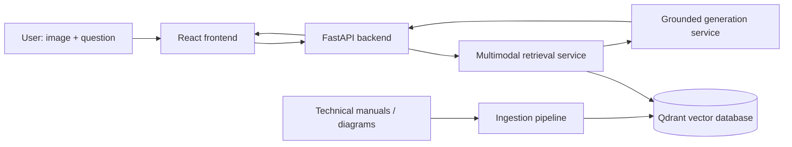

# Multimodal Repair Assistant

A portfolio-grade multimodal Retrieval-Augmented Generation (RAG) system for grounded technical troubleshooting from **text, images, diagrams, and manuals**.

The first demonstrated domain is bicycle repair, but the ingestion and retrieval architecture is intentionally domain-agnostic so the system can later support other technical-document collections.

## Product vision

A user should be able to upload an image of a damaged or malfunctioning component, ask a natural-language question, and receive a response grounded in a private knowledge base with page-level citations and supporting visual evidence.

The system is being designed to:

- retrieve relevant text passages, diagrams, and page images;
- combine text and visual evidence before generation;
- preserve document and page metadata for citations;
- return an **insufficient evidence** response instead of inventing unsupported guidance;
- evaluate retrieval quality separately from answer generation.

## Target architecture



## Planned stack

| Area | Technology |
| --- | --- |
| Backend | Python, FastAPI, Pydantic |
| PDF / image ingestion | PyMuPDF, Pillow |
| Embeddings | Sentence Transformers, CLIP-compatible multimodal models |
| Vector search | Qdrant |
| Frontend | React |
| Testing | pytest |
| Infrastructure | Docker, GitHub Actions |
| Deployment | Cloud Run or equivalent |

## Repository structure

```text
multimodal-repair-assistant/
├── data/
│   ├── documents/
│   ├── extracted/
│   └── evaluation/
├── src/
│   ├── ingestion/
│   ├── retrieval/
│   ├── generation/
│   ├── api/
│   └── common/
├── scripts/
├── tests/
├── frontend/
├── storage/
├── .github/workflows/
├── AGENTS.md
├── pyproject.toml
├── requirements.txt
└── README.md
```

## Development roadmap

- [x] Repository architecture and engineering conventions
- [ ] Phase 1 — PDF document ingestion
- [ ] Phase 2 — Text chunking, embeddings, and semantic retrieval
- [ ] Phase 3 — Multimodal image + text retrieval
- [ ] Phase 4 — Grounded answer generation with citations
- [ ] Phase 5 — FastAPI service and React interface
- [ ] Phase 6 — Retrieval and answer-quality evaluation
- [ ] Phase 7 — Docker, CI/CD, monitoring, and cloud deployment

## Evaluation plan

Retrieval will be evaluated independently from generation using a labeled query set and metrics such as:

- Recall@K
- Mean Reciprocal Rank (MRR)
- nDCG
- citation correctness
- response latency

No model-quality claims will be made without measured results.

## Local setup

```bash
git clone https://github.com/ShayanNazir/multimodal-repair-assistant.git
cd multimodal-repair-assistant

python3 -m venv .venv
source .venv/bin/activate

pip install -r requirements.txt
```

Run tests with:

```bash
pytest
```

## Data

Source manuals and generated artifacts are intentionally excluded from Git. Place local source PDFs in:

```text
data/documents/
```

Generated extraction outputs will live under:

```text
data/extracted/
```

Only use documents whose licenses or terms permit your intended use. Do not redistribute third-party manuals through this repository unless their licenses allow it.

## Engineering principles

- Keep ingestion, retrieval, generation, and API layers modular.
- Preserve source-document and page metadata through the full pipeline.
- Test retrieval before adding a language model.
- Keep secrets out of source control.
- Prefer measurable system behavior over demo-only claims.
- Add new capabilities incrementally and keep the README current.

## Status

Active development. The repository is currently scaffolded for the document-ingestion milestone.
